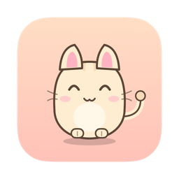
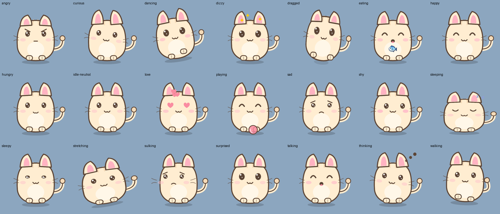

<div align="center">



# Kokosuki

**A fully-offline macOS desktop pet with an on-device LLM mind.**
One self-contained `.app` — the language model ships inside the bundle.
No cloud, no accounts, no telemetry. Nothing ever leaves your Mac.




*Every state above is drawn procedurally with SwiftUI Canvas — the whole cat is vector code.*

</div>

## What is this?

Kokosuki is a little cat who lives on your desktop, powered by a quantized
1B-parameter LLM ([MiniCPM5-1B](https://huggingface.co/mlx-community/MiniCPM5-1B-OptiQ-4bit))
running locally on the Apple Silicon GPU via
[MLX Swift](https://github.com/ml-explore/mlx-swift). What she *says* is wired
to what she *does*: every generated reply carries an emotion tag that drives her
face and animations, her live state (hunger, energy, mood, what she's doing,
what just happened to her) is injected into every prompt, and chat commands are
actually obeyed — tell her to dance and she dances.

### She acts on her own

- Wanders along the bottom of your screen, stretches, spins, naps when tired
- **Jumps onto your app windows**, walks along their top edges, rides them when
  you drag them, and tumbles off (surprised) when you close them
- Gets hungry over time, sulks when neglected, sleeps at night
- Watches your cursor, blinks, flicks her ears
- **Talks to you spontaneously** — lines generated on-device from her live state

### You can interact

| Action | Result |
|---|---|
| Click | poke her (spam-poking makes her angry) |
| Double-click | open the chat window |
| Right-click / menu-bar icon | feed 🐟🍪, play 🧶, nap 💤, call her over, settings |
| Drag & toss | pick her up (she flails!) — real physics, squash-and-stretch landing |
| Stroke back and forth | petting → hearts and purring |

### Chat with her — she obeys and delivers

- **Commands**: dance / spin / jump / come here / go to sleep / wake up / climb
  onto a window / get down / play / eat / stop — detected deterministically in
  Chinese, English, and Japanese, so she obeys even when the small model forgets
  its action tag
- **Creative asks**: tell a joke, tell a story, write a poem (in a style you
  name), write a short essay, riddles, word games, a song, a fortune, praise —
  a longform generation mode with delivery-enforcing quality gates and curated
  fallback content guarantees you always get the thing you asked for
- **Context**: she remembers the conversation, knows what just happened to her
  ("you just petted me!", "I fell off a window two minutes ago"), and answers
  profile questions consistently (age, birthday, zodiac, likes, dislikes)
- **Trilingual**: UI and dialogue in 简体中文, English, and 日本語

## Getting started

```bash
git clone https://github.com/Fangyuan025/Kokosuki.git
cd Kokosuki

# download the model weights (~907 MB, not in the repo) — see model/README.md
cd model && for f in config.json generation_config.json model.safetensors \
  model.safetensors.index.json tokenizer.json tokenizer_config.json \
  chat_template.jinja; do \
  curl -L -O "https://huggingface.co/mlx-community/MiniCPM5-1B-OptiQ-4bit/resolve/main/$f"; done
cd ..

# build + bundle + sign → a single self-contained app
./scripts/package_app.sh
open build/Kokosuki.app
```

Requirements: Apple Silicon Mac, macOS 14+, Xcode command line tools with the
Metal compiler. Full details, packaging internals, and **how to build with a
different MLX model** (Qwen, Gemma, larger MiniCPMs, …) are in
[docs/BUILDING.md](docs/BUILDING.md).

## How it works

```
┌────────────────────────────── Kokosuki.app ──────────────────────────────┐
│                                                                          │
│  PetEngine (30 Hz)          PetView                    Brain             │
│  ├─ physics: gravity,       ├─ SwiftUI Canvas,         ├─ MLX Swift      │
│  │  toss, squash/stretch    │  procedural vector cat   │  (GPU inference)│
│  ├─ autonomy state machine  ├─ 20+ emotion/activity    ├─ manual ChatML  │
│  ├─ window-top platforms    │  states, particles       ├─ rejection      │
│  │  (CGWindowList)          └─ 30 fps timeline         │  sampling gates │
│  ├─ stats + event memory                               ├─ curated        │
│  └─ intent detection ───────── commands/creative ─────►│  fallbacks      │
│                                                        └─ MiniCPM5-1B   │
│  speech bubble ◄─── streamed, emotion-tagged replies ───┘   (bundled)    │
└──────────────────────────────────────────────────────────────────────────┘
```

Highlights for the curious:

- **Speech ↔ behavior coupling**: replies are forced into `[emotion] text [action]`
  shape (the assistant turn is prefilled with `[`); the emotion drives the face
  the moment it streams in, the action tag triggers real animations.
- **Reliability engineering for a 1B model**: every reply passes deterministic
  quality gates — language match, no instruction echo, no verbatim repeats
  (n-gram overlap catches re-punctuated self-plagiarism), no
  announced-but-undelivered content, correct trivial arithmetic, tone checks —
  with automatic resampling and hand-written fallback content as the backstop.
- **Window parkour** uses only public `CGWindowList` bounds — no accessibility
  or screen-recording permissions required. The app requests no permissions at all.
- **Batch-tested**: `--selftest` and `--scenarios` run trilingual generation
  suites with measurable pass gates (see [docs/BUILDING.md](docs/BUILDING.md#development-utilities)).

## Privacy

Everything runs in-process on your GPU. The app makes zero network requests,
requests zero system permissions, and stores its state (pet stats, chat
history, settings) in `~/Library/Application Support/Kokosuki/`.

## License

[MIT](LICENSE) — the bundled model retains its own
[Apache-2.0 license](https://huggingface.co/mlx-community/MiniCPM5-1B-OptiQ-4bit).
